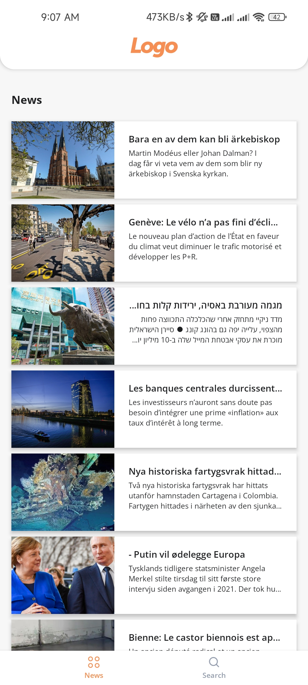
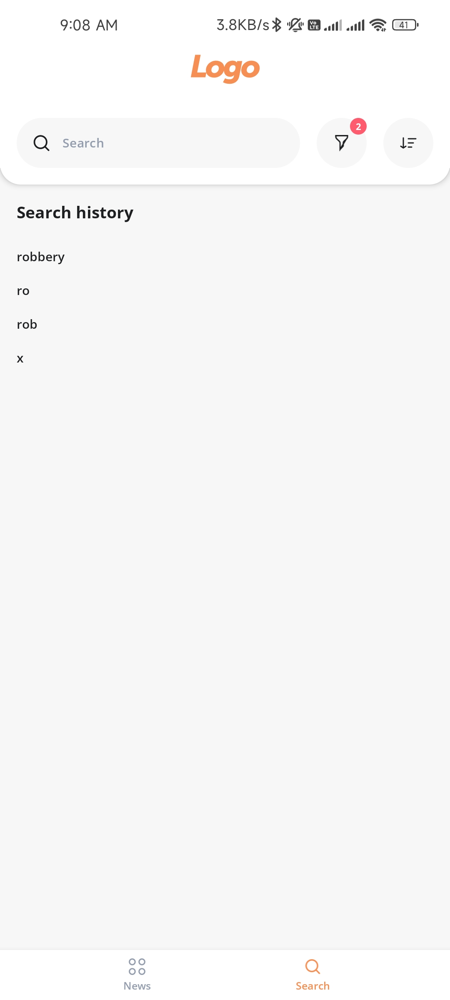
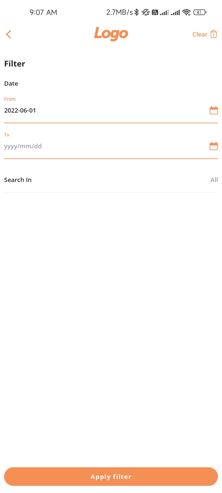
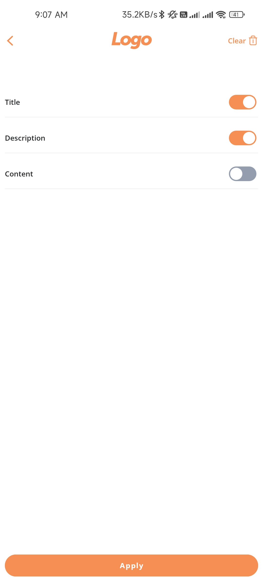
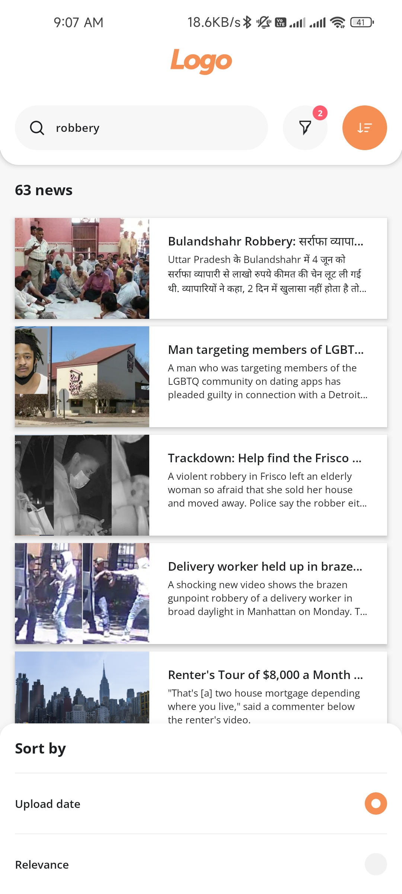

GNews
======

**It’s single activity app with MVVM architecture. It use coroutines as reactive library, Glide for
image loading, Retrofit for server requests and Datastore as asynchronous Shared preferences**

Screenshots
-----------

|                      Headlines                      |                  Search History                   |                      Filter                      |
|:---------------------------------------------------:|:-------------------------------------------------:|:------------------------------------------------:|
|  |  |  |
|                    __Search in__                    |                 __Search result__                 |                                                  |
|       |   |                                                  |

Libraries and APIs used in this project
------------------------------

* [Coroutines][1]
* [DataStore][2]
* [Retrofit][3]
* [Glide][4]
* [GNews.io][5]

[APK][6]
---

[1]: https://developer.android.com/kotlin/coroutines

[2]: https://developer.android.com/topic/libraries/architecture/datastore

[3]: https://square.github.io/retrofit/

[4]: https://github.com/bumptech/glide

[5]: https://gnews.io/

[6]: GNews_1.0.0.apk